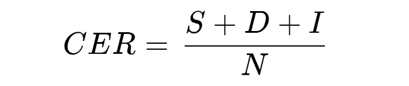

# ml_conformer_ctc
conformer_ctc

<!-- code_chunk_output -->

- [Conformer_ctc with NeMo](#conformer_ctc-with-NeMo)
- [Requirements](#requirements)
- [How to install](#how-to-install)
- [Data](#data)
- [Preprocessing](#preprocessing)
- [Result](#result)
- [Competition](#competition)
- [Reference](#reference)

<!-- /code_chunk_output -->

---

## Conformer_ctc with NeMo

NeMo 기반 Conformer_ctc를 사용하여 한국어 음성인식을 진행하였습니다.

## Requirements

- python==3.9.2

## How to install

### in colab

```python
!pip install nemo_toolkit['all']
!pip install nlptutti
```

### in vscode

```sh
python -m venv .venv
```

Ctrl+Shift+P</br>
Python:Select Interpreter</br>
Python 3.9.2('.venv':venv)

```sh
pip install --upgrade pip
pip install nemo_toolkit['all']
pip install nlptutti
pip install -r requirements.txt
```

## Data

### Source

1. [AIHub 자유대화 음성(일반남여)](https://www.aihub.or.kr/aihubdata/data/view.do?currMenu=115&topMenu=100&aihubDataSe=realm&dataSetSn=109)

### Dataset 구성

|  | 데이터 요약데이터 구분 | 제공 방식 |
| --- | --- | --- |
| 자유대화
(일반남여) | 10대에서 50대 사이의 일반인 남녀의 발화 데이터
녹음 인원 2,000명 이상, 4,000시간 음성 데이터 | 원천데이터: PCM(WAV) 파일 포맷
메타데이터: JSON 파일 포맷 |

### 어노테이션

- Studio에서 녹음DB 이외의 실 환경에서 수집 받은 음성데이터에는 외부 잡음 등이 포함되어 있
으니, 외부 잡음 Filler Noise를 철자 전사 정보에 추가
    - (NO:) 내일 오후 세시에 예약해 주세요
- 자유 발화인 경우, 녹음자도 모르는 사이에 발성하는 어’,‘음’, ‘글세’ 등도 음성인식 학습에 필요한
정보이기 때문에 간투어 Filler Pause 정보를 철자 전사 정보에 추가
    - (FP:음) 내일 오후 세시에 예약해 주세요
- 유아, 노인들이 발성할 경우, 전사자가 들었을 때 명확하게 철자전사 작업을 하지 못할 음성 전
사는 발성오류 정보를 추가
    - 내일 오후 (SP:세시에) 예약해 주세요
    : 세시, 네시 가 명확하게 들리지 않는 경우
- 마이크로폰 근접에서 발성하는 경우, 녹음자의 들숨, 날숨, 웃음 소리 등이 녹음되는 음원의 경우
는 화자 잡음 Speaker Noise를 철자 전사 정보에 추가
    - (SN:) 내일 오후 세시에 예약해 주세요 (SN:)


### Data dir
```
30G     ./[원천]1.AI챗봇_2
30G     ./[원천]1.AI챗봇_3
31G     ./[원천]1.AI챗봇_4
30G     ./[원천]1.AI챗봇_5
30G     ./[원천]1.AI챗봇_6
14G     ./[원천]1.AI챗봇_7
30G     ./[원천]2.음성수집도구_1
29G     ./[원천]2.음성수집도구_2
31G     ./[원천]2.음성수집도구_3
24G     ./[원천]2.음성수집도구_4
8.2G    ./[원천]2.음성수집도구_5
28G     ./[원천]3.스튜디오_1
11G     ./[원천]3.스튜디오_2
5.3G    ./[라벨]1.AI챗봇
2.7G    ./[라벨]2.음성수집도구
840M    ./[라벨]3.스튜디오
30G     ./[원천]1.AI챗봇_1
714G    .
```


### Training set

- 전체 데이터

    |  |  |
    | --- | --- |
    | PCM 파일수 | 489 |
    | WAV 파일수 | 2,278,494 |
    | 용량 | 356GB |
    | 시간 |  |

- 디렉토리별

    |  | # of PCM | # of WAV | 시간(hh:mm:ss) | 용량 |
    | --- | --- | --- | --- | --- |
    | [원천]1.AI챗 봇_1 | 0 | 211,761 | 983501.084 | 30GB |
    | [원천]1.AI챗 봇_2 | 0 | 204692 | 989834.899 | 30GB |
    | [원천]1.AI챗 봇_3 | 0 | 221786 | 984377.509 | 30GB |
    | [원천]1.AI챗 봇_4 | 0 | 227032 | 990828.945 | 31GB |
    | [원천]1.AI챗 봇_5 | 0 | 219714 | 984580.266 | 30GB |
    | [원천]1.AI챗 봇_6 | 0 | 218792 | 975718.892 | 30GB |
    | [원천]1.AI챗 봇_7 | 0 | 60510 | 445906.040 | 14GB |
    | [원천]2.음성수집도구_1 | 0 | 179231 | 987813.540 | 30GB |
    | [원천]2.음성수집도구_2 | 0 | 155957 | 930430.800 | 29GB |
    | [원천]2.음성수집도구_3 | 0 | 173654 | 988967.150 | 31GB |
    | [원천]2.음성수집도구_4 | 0 | 137107 | 792501.950 | 24GB |
    | [원천]2.음성수집도구_5 | 0 | 47937 | 269081.550 | 8.2GB |
    | [원천]3.스튜디오_1 | 489 | 156090 | 906086.260 | 28GB |
    | [원천]3.스튜디오_2 | 0 | 58210 | 337949.440 | 11GB |
    | 계 | 489 | 2,272,473 |  | 356GB |

### Validation set (사실상 Test set)

- 전체 데이터

    |  |  |
    | --- | --- |
    | PCM 파일수 | 0 |
    | WAV 파일수 | 26만 개 |
    | 용량 | 89 GB(레이블포함) |
    | 시간 | 366 시간 |

- 디렉토리별

    |  | # of PCM | # of WAV | 시간(hh:mm:ss) | 용량 |
    | --- | --- | --- | --- | --- |
    | [원천]1.AI챗 봇 | 0 | 149,008 | 200:09:34 | 24GB |
    | [원천]2.음성수집도구 | 0 | 87,273 | 125:57:53 | 15GB |
    | [원천]3.스튜디오 | 0 | 27,093 | 39:55:41 | 4.7GB |
    | 계 | 0 | 26,374 | 366:03:08 | 43.7GB |

### Preprocessed Data Set

- 전처리 및 정제가 끝난 Trainset의 정보
- 총 2800시간, 약 200만개의 음성파일

- Train set

    | # of wav files  | 1,806,842 |
    | --- | --- |
    | Duration(hh:mm:ss) | 2514:18:16 |

- Valid set

    | # of wav files  | 200,761 |
    | --- | --- |
    | Duration(hh:mm:ss) | 279:50:52 |

## Preprocessing

- 추후 업데이트


## Result

### 평가지표 : CER(Character Error Rate)(e.g. two classes)


- Substitution (S): 추론된 텍스트 중 정답 텍스트와 비교해 잘못 대체된 음절 수

- Deletion (D): 추론된 텍스트 중 정답 텍스트와 비교해 잘못 삭제된 음절 수

- Insertion (I): 추론된 텍스트 중 정답 텍스트와 비교해 잘못 추가된 음절 수

- N: 정답 텍스트의 음절 수

### Accuracy

|  model  |   CER(%)   | data |
| :---: | :---: | :---: |
| conformer_ctc | 8.3 | AIHub 자유대화 음성(일반남여) |
| conformer_ctc | 19.2 | AIHub 인공지능 학습을 위한 외국인 한국어 발화 음성(한국일반-발화능력 상) |
| conformer_ctc | 23 | AIHub 인공지능 학습을 위한 외국인 한국어 발화 음성(한국일반-발화능력 중) |
| conformer_ctc | 25.7 | AIHub 인공지능 학습을 위한 외국인 한국어 발화 음성(한국일반-발화능력 하) |

### Analysis

- 한국어 교육 어플리케이션에 사용할 한국어 음성인식기이므로 일반 한국인 남녀의 한국어 발화 데이터로 학습시켰다.
- 따라서 외국인의 한국어 발화 데이터에 대한 평가 결과는 한국인에 비해 낮을 것이다.
- 외국인이 한국인처럼 말하게 하는 것을 목표로 하는 어플리케이션이기 때문에 외국인의 테스트 결과를 참고하기 위해 한국어 발화능력에 따라 상, 중, 하로 나눠진 데이터를 테스트하였다. 
- 그 결과 한국어 발화능력 상에 해당하는 외국인들의 평균이 19.2 정도로 나왔다.
- 따라서 CER 10% 이내로 결과가 나온다면 great, CER 20%이내로 결과가 나온다면 good을 return해주고 CER이 그 이상이라면 bad를 return해주어 다시 녹음하도록 한다.


### In App

<!--  -->
- 추후 업데이트

## Competition
- [2022 한국어 AI 경진대회](https://competition.aihub.or.kr/hackathon/scheduleDetail/10000)
- 한국어 음성인식 성능향상 Track 01 참가 (팀명: 서강프렌즈)
- [데이터 품질리뷰상(특별상) 수상](https://www.sogang.ac.kr/gopage/goboard2.jsp?bbsConfigFK=58&pkid=535170)

---

## Reference

- [NeMo](https://github.com/NVIDIA/NeMo)
- [AIHub](https://aihub.or.kr)